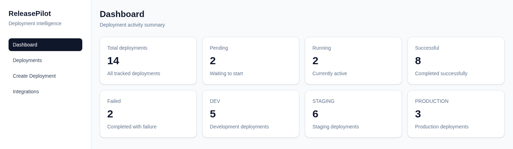
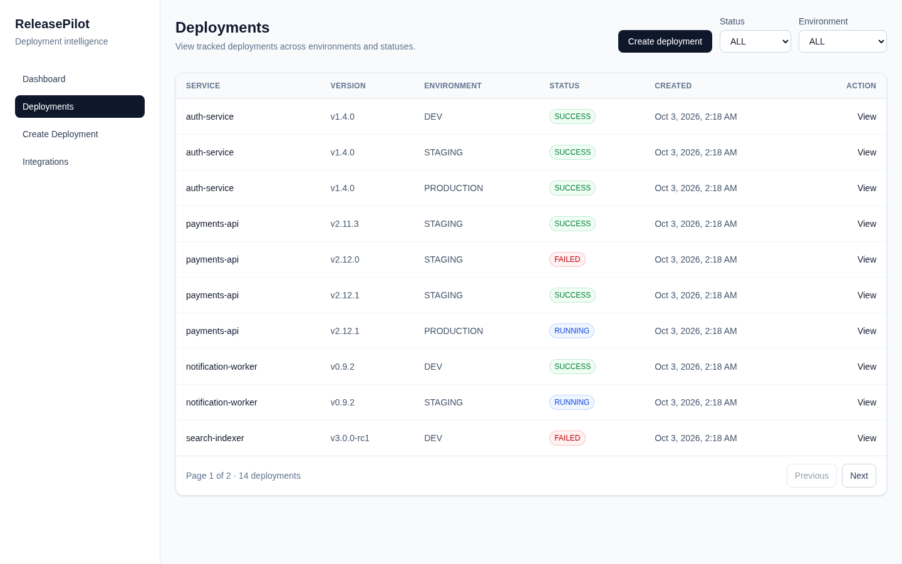
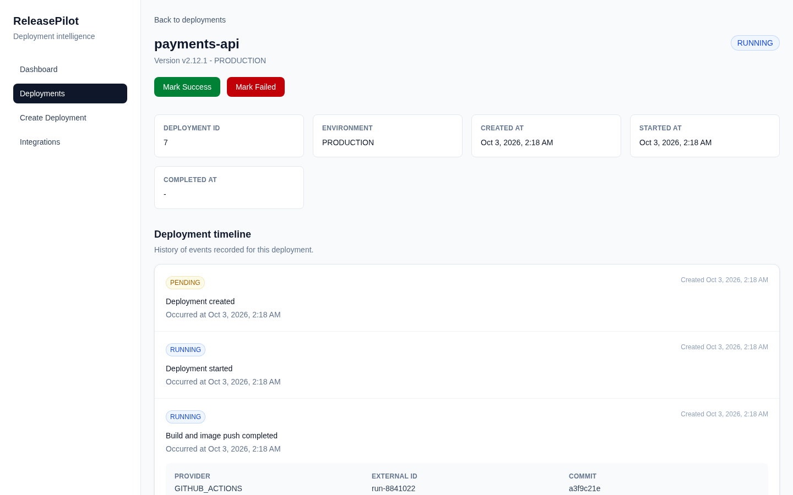
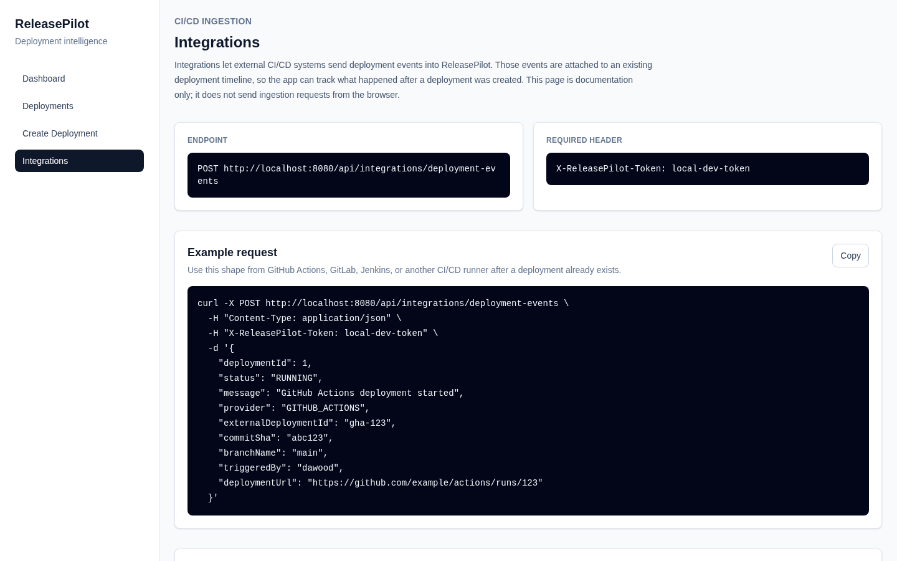

# ReleasePilot

A deployment tracking dashboard: one place to see which service version went to which environment, what state it is in, and what your CI/CD pipeline reported along the way.

**Live demo:** _coming soon_ · **API docs:** _coming soon_

Built with Spring Boot, PostgreSQL and Next.js as a portfolio project. The project is finished; see [Scope](#scope) for what is in and what was deliberately left out.



| Deployments | Deployment timeline | CI/CD integration |
| --- | --- | --- |
|  |  |  |

## Features

- **Deployment tracking:** service name, version, environment (`DEV`, `STAGING`, `PRODUCTION`) and lifecycle timestamps.
- **Controlled lifecycle:** `PENDING → RUNNING → SUCCESS | FAILED`. Invalid transitions are rejected and the final states cannot change.
- **Timeline events:** every deployment has an event history shown on its detail page.
- **CI/CD ingestion API:** external tools (GitHub Actions, GitLab, Jenkins, …) post events with a shared token. Retries are idempotent on `provider + externalDeploymentId + status`.
- **Duplicate protection:** the same service, version and environment cannot be created twice. This is enforced in the service layer and by a database unique constraint.
- **Dashboard summary:** counts by status and environment.
- **Filtering and pagination:** deployment lists can be filtered by status and environment.
- **Operational basics:** Flyway migrations, Actuator health checks, Swagger UI, Spring profiles and Dockerized full stack.

## Tech Stack

| Layer | Technology |
| --- | --- |
| Backend | Java 21, Spring Boot 3.5, Spring Web, Spring Data JPA, Bean Validation |
| Database | PostgreSQL 17, Flyway |
| Frontend | Next.js 16 (App Router), React 19, TypeScript, Tailwind CSS 4, TanStack Query |
| API docs / health | Springdoc OpenAPI (Swagger UI), Spring Boot Actuator |
| Testing | JUnit 5, Mockito |
| Runtime | Docker, Docker Compose. Deployed on AWS EC2 with Amazon RDS. |

## Architecture

```text
Browser ──> Next.js frontend :3000
              │  typed fetch + TanStack Query
              v
            Spring Boot API :8080 ──> Service layer ──> Spring Data JPA ──> PostgreSQL
              ^
CI/CD tool ───┘  POST /api/integrations/deployment-events  (X-ReleasePilot-Token)
```

## API Overview

```text
GET   /api/dashboard/summary

POST  /api/deployments
GET   /api/deployments?status=RUNNING&environment=PRODUCTION&page=0&size=10
GET   /api/deployments/{id}
GET   /api/deployments/{id}/events
PATCH /api/deployments/{id}/start
PATCH /api/deployments/{id}/success
PATCH /api/deployments/{id}/fail

POST  /api/integrations/deployment-events     (header: X-ReleasePilot-Token)

GET   /actuator/health
GET   /swagger-ui.html
```

Detailed notes:

- [CI/CD ingestion API](docs/ci-cd-ingestion.md)
- [Dashboard summary contract](docs/dashboard-summary.md)
- [Environment configuration](docs/configuration.md)
- [Deploying to AWS (EC2 + RDS)](docs/deployment-aws.md)

## Running Locally

Full stack in Docker (PostgreSQL, backend and frontend):

```bash
docker compose up --build
```

- Frontend: http://localhost:3000
- Backend: http://localhost:8080
- Swagger: http://localhost:8080/swagger-ui.html
- PostgreSQL: `localhost:5433`

`docker compose down -v` resets the database.

For manual development (requires Java 21, Maven and Node.js 22):

```bash
docker compose up -d postgres
mvn spring-boot:run              # backend on :8080 (dev profile)
cd frontend && npm install && npm run dev   # frontend on :3000
```

Tests and checks:

```bash
mvn test                          # backend unit tests
cd frontend && npm run lint && npm run build
```

Configuration comes from environment variables. Safe defaults are in `.env.example` and `frontend/.env.example`. The `prod` profile requires every value to be set explicitly and runs Hibernate in `validate` mode, because Flyway owns the schema.

## Scope

This is a finished portfolio project, so its scope is fixed on purpose. The table below separates what is built, what was cut on purpose, and what is a known gap.

### Implemented

- REST API with validation, consistent error responses and the controlled lifecycle above
- PostgreSQL persistence with Flyway-managed schema
- Idempotent CI/CD event ingestion protected by a shared token
- Next.js dashboard, deployment list/detail/create pages and integration docs page
- Docker Compose for local full stack and for EC2 + external RDS
- Service-layer unit tests (JUnit 5 + Mockito)

### Deliberately not implemented

These are real production concerns that I left out on purpose, not by accident:

| Not implemented | Why it was cut |
| --- | --- |
| User authentication, JWT, roles, multi-tenancy | Adding auth would double the size of the project without showing anything new about deployment tracking. The only protected endpoint is ingestion, which uses a shared token. |
| CI pipeline (GitHub Actions) | Tests and builds are run locally. |
| Testcontainers / repository integration tests | Coverage stops at the service layer. |
| Frontend and end-to-end browser tests | Not needed for a single-developer demo. |
| Deleting deployments | Deployments are kept as an audit history. |
| Monitoring beyond Actuator health | Logs and metrics would come from the hosting platform. |

### Known limitations

- CI/CD ingestion only adds timeline events. It does **not** change the deployment's current status.
- Validation errors report the first invalid field only.
- The demo deployment exposes ports `3000` and `8080` directly over HTTP. A production setup would put them behind HTTPS and a load balancer, and would keep secrets in AWS Secrets Manager.
